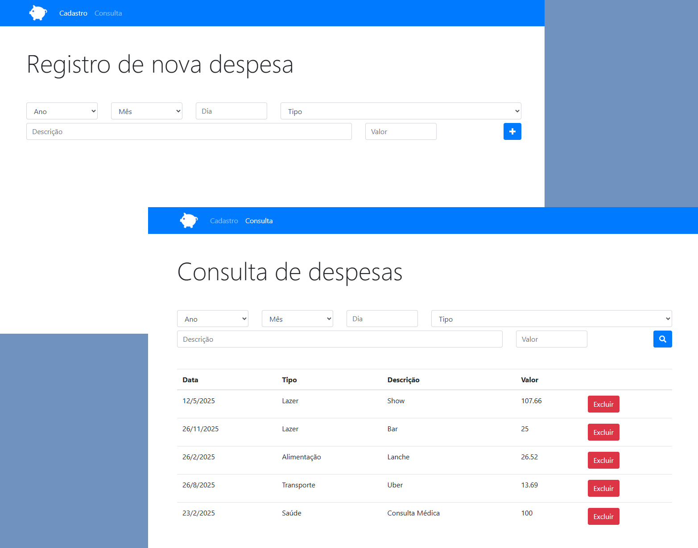

  

## 🎉 Let's go!

Para iniciar o projeto abra o arquivo `index.html` em seu navegador.

## 💻 Projeto

Aplicação web simples para controle de despesas pessoais, desenvolvida em JavaScript puro, HTML e Bootstrap. Permite ao usuário cadastrar, consultar, filtrar e excluir despesas, armazenando os dados localmente no navegador (localStorage). O sistema possui interface responsiva, feedback visual via modal e filtros por data, tipo, descrição e valor.

### Funcionalidades:
- Cadastro de novas despesas com campos de data, tipo, descrição e valor
- Consulta e filtro de despesas já cadastradas
- Exclusão de despesas individualmente
- Armazenamento local dos dados (não requer backend)
- Interface amigável e responsiva com Bootstrap

## 🚀 Tecnologias

Esse projeto foi desenvolvido com as seguintes tecnologias:

- HTML
- JavaScript
- Bootstrap

